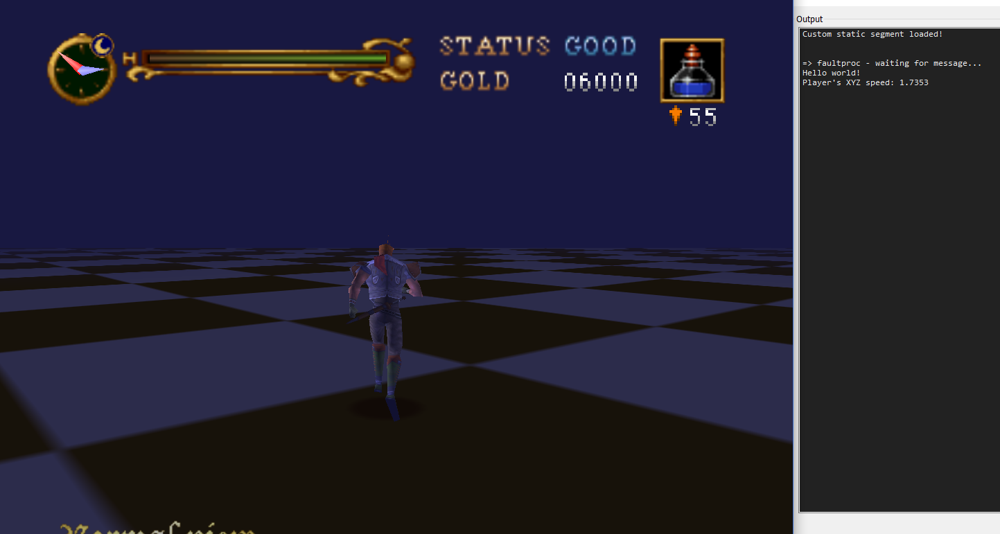

# obj_test

This object will print "Hello world!" and the player's screen to the debugging console every 3 seconds.

[Use the following script](https://github.com/LuigiBlood/EmuScripts/blob/c9fef6bd6e109130d5d84746648a5c0180492726/N64/Project64_JSAPI2/Partner-N64_CartMapper.js) to view the contents of the debugging console in an emulator.

This object is spawned in the Test Grid map, which can be accessed by holding L + R + Z 
(see `src/static/static_segment.c`)

## Preview

